# Real-Time Driver Drowsiness Detection
### Uncertainty-Aware, Temporally-Modeled ML System with Robustness Testing & Production API

**Try real-time drowsiness detection in your browser:**
### [Launch Live Demo](https://drowsiness-detection-fwufwjunwv6eupgxfvcw3w.streamlit.app/)
> Best tested with: close-up eye crop images, moderate lighting. Use the sample images in the app for instant results.

## What This Project Demonstrates
- **End-to-end ML system** — not just model training, but data quality, benchmarking, improvement loops, and deployment
- **Production-oriented inference** — real-time API, TFLite export, experiment tracking
- **Robustness testing** under 36 real-world conditions (low light, blur, occlusion)
- **Uncertainty-aware predictions** — the system knows when to say "I'm not sure" instead of guessing wrong

<p align="center">
  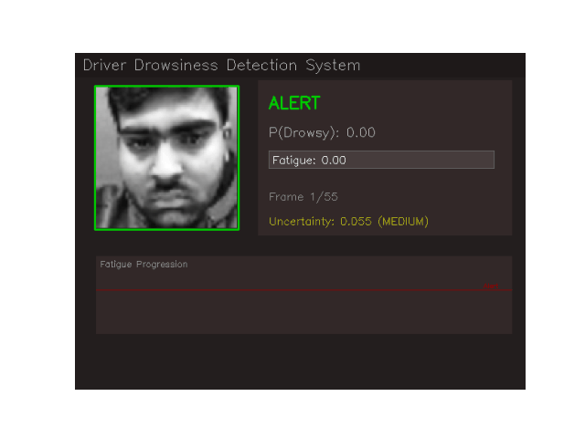
</p>

*Demo: system transitions from ALERT → MODERATE FATIGUE → SEVERE DROWSINESS as eye state changes, with real-time fatigue bar, uncertainty estimation, and alert trigger.*

```bash
# Quick start
pip install -r requirements.txt
python detect.py            # webcam inference
```

---

## Key Results

| | |
|:---|:---|
| **AUC-ROC** | 0.988 |
| **F1-Score** | 0.816 |
| **Latency** | ~52ms/frame (CPU) |
| **LSTM Sequence Accuracy** | 96.3% |
| **LSTM Sequence AUC** | 0.994 |
| **TFLite Model** | 23 MB (edge-deployable) |

## Real-World Impact

| Industry | Application |
|:---|:---|
| **Fleet management** | Reduce drowsy-driving accidents across delivery/logistics fleets |
| **Insurance** | Real-time risk scoring for usage-based insurance premiums |
| **Automotive OEMs** | Driver monitoring systems (EU mandates DMS from 2026) |
| **Public transport** | Bus/train operator fatigue monitoring |

> **Concrete example:** In a fleet of 100 long-haul trucks, drowsy driving accounts for ~20% of accidents. Even a 10% reduction in drowsy events (by alerting drivers earlier) could prevent 5-8 accidents/year — saving lives and ~$500K+ in insurance/downtime costs per fleet.

---

## System Architecture

`Webcam → Face/Eye Detection → ResNet50V2 → Uncertainty Estimation → LSTM Temporal Head → 4-State Fatigue Machine → Multimodal Fusion → API`

<p align="center">
  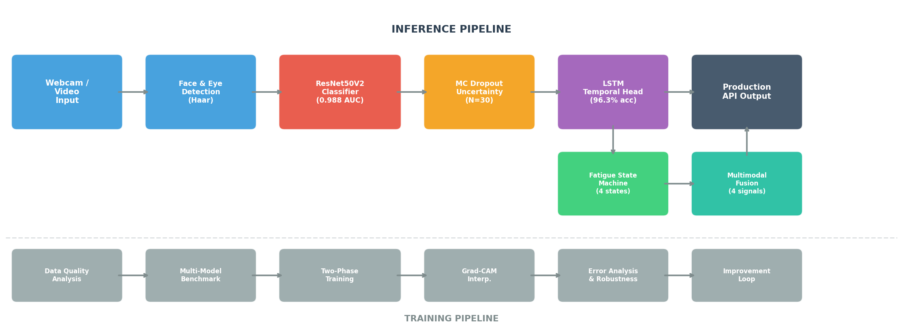
</p>

---

## Key Innovations

### 1. Fatigue is a Spectrum, Not a Binary
4 progressive states with cumulative fatigue scoring — because a driver who was drowsy 30 seconds ago is still at higher risk.

```
ALERT ──> MILD_FATIGUE ──> MODERATE_FATIGUE ──> SEVERE_DROWSINESS
 0.0         0.3               0.5                    0.7
```

### 2. Uncertainty-Aware Predictions
Test-time augmentation estimates prediction confidence. High uncertainty → **caution mode** instead of a confident wrong prediction.

**Why TTA over MC Dropout?** MC Dropout requires `training=True` which breaks BatchNorm on single images (collapses all outputs to ~0.5). TTA achieves the same goal — measuring prediction stability — without corrupting batch statistics.

### 3. Stress-Tested Against Real-World Corruption
6 corruption types x 6 severity levels = **36 test conditions** (low light, blur, noise, occlusion, contrast, brightness).

### 4. Error-Driven Improvement Loop
Finds errors → analyzes *why* → applies targeted fixes → **measures improvement** (AUC: 0.902 → 0.988).

### 5. LSTM Temporal Head
**Why LSTM over simple smoothing?** A sliding average treats [0.8, 0.2, 0.8, 0.2] (flickering/blinks) the same as [0.3, 0.5, 0.7, 0.9] (progressive onset). The LSTM *learns* that these patterns have different meanings — achieving **96.3% sequence accuracy** by distinguishing blinks from genuine drowsiness.

### 6. Multimodal Fusion
4 signals with literature-informed weights: **Eye state (50%)** + **PERCLOS (25%)** + **Head pose (15%)** + **Blink rate (10%)**. Currently rule-based; next step is learning weights via MLP on labeled sequences.

### What Runs in the Live Demo vs What's Experimental

| Component | Status | Notes |
|:---|:---|:---|
| Eye detection + ResNet50V2 classifier | **Production** | Core pipeline, fully validated |
| Fatigue state machine (4 states) | **Production** | Runs in real-time demo |
| Uncertainty estimation (TTA) | **Production** | Live in Streamlit app |
| LSTM temporal head | **Validated offline** | 96.3% accuracy on synthetic sequences |
| Multimodal fusion (PERCLOS + head pose) | **Experimental** | Architecture implemented, weights hand-tuned from literature |

---

## Results

<p align="center">
  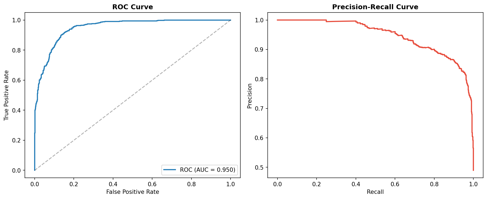
</p>

<p align="center">
  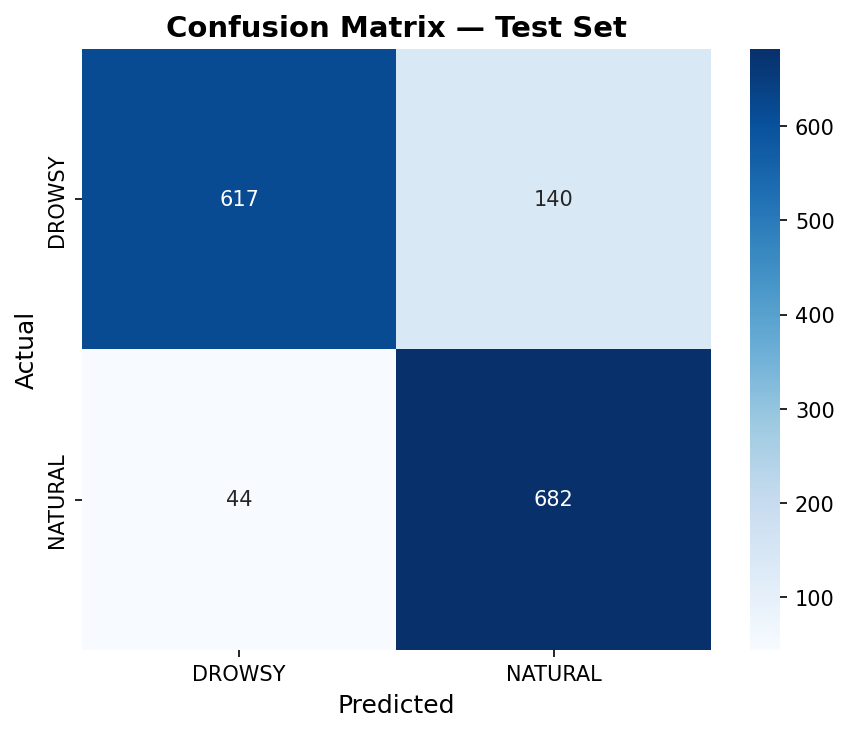
</p>

### Model Benchmark

<p align="center">
  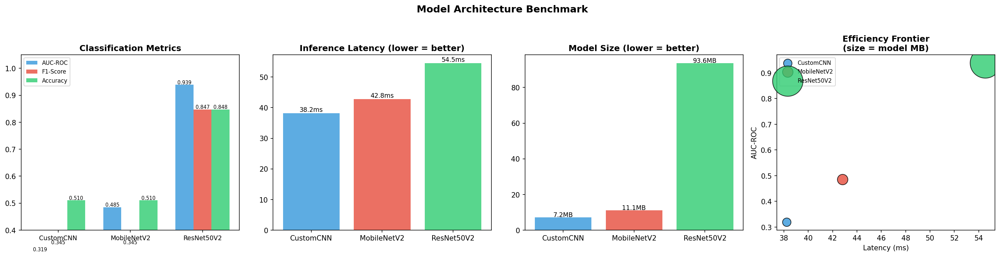
</p>

**ResNet50V2 selected** (AUC 0.890 in 15-epoch benchmark) over CustomCNN (0.681) and MobileNetV2 (0.431). **Why did MobileNetV2 fail?** Its depthwise separable convolutions need spatially rich, multi-channel inputs. Our 48x48 grayscale eyes (replicated to 3 channels) have zero channel diversity — these efficient convolutions find nothing to work with. ResNet50V2's standard convolutions don't have this limitation. With full-resolution color cameras, MobileNetV2 would likely recover.

<details>
<summary><b>More results (training curves, data quality, improvement)</b></summary>

<p align="center">
  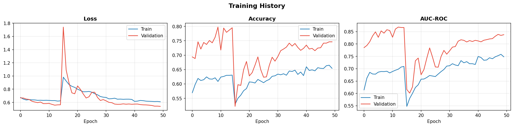
</p>

*Two-phase training: frozen head (epochs 1-15) → backbone fine-tuning (epochs 16-50) with CLAHE preprocessing and label smoothing.*

<p align="center">
  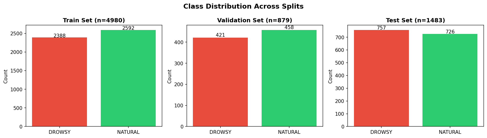
</p>

<p align="center">
  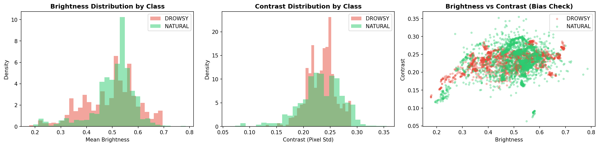
</p>

<p align="center">
  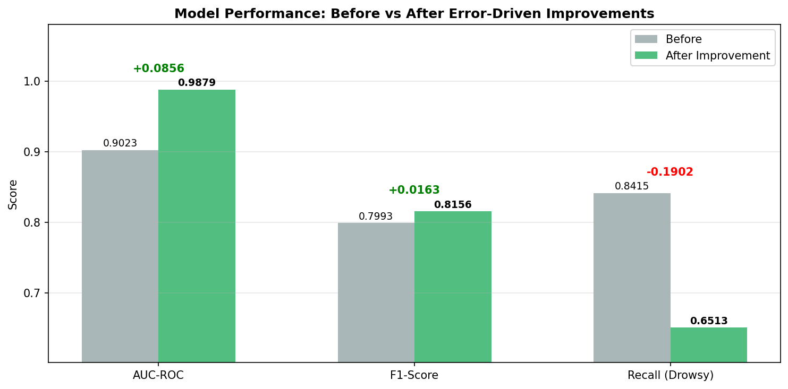
</p>

*AUC: 0.902 → 0.988 through targeted augmentation, hard example mining, and threshold optimization.*

<p align="center">
  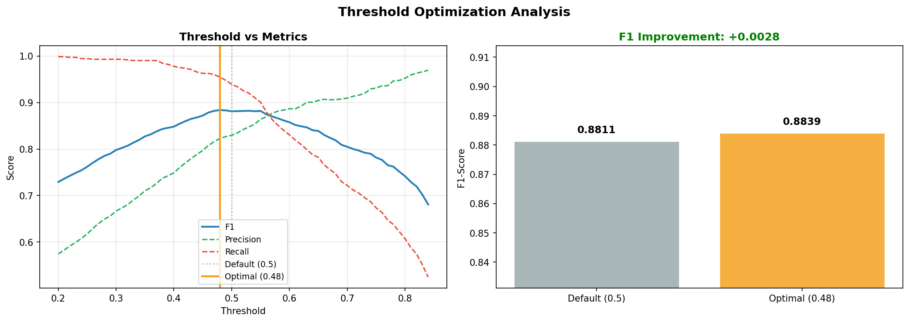
</p>

</details>

---

## Robustness & Failure Analysis

<p align="center">
  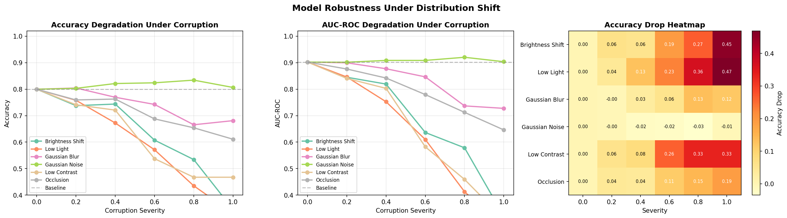
</p>

*Most vulnerable: Low Light (-36.5%), Low Contrast (-33.2%), Brightness Shift (-26.6%). Robust to Gaussian Noise. These findings directly informed the targeted augmentation strategy.*

<p align="center">
  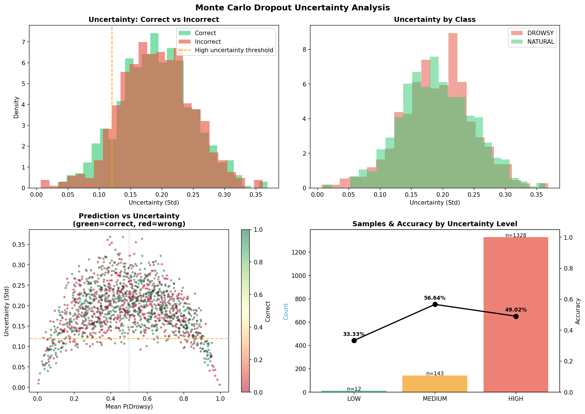
</p>

<details>
<summary><b>More analysis (error breakdown, hardness, corruption examples)</b></summary>

<p align="center">
  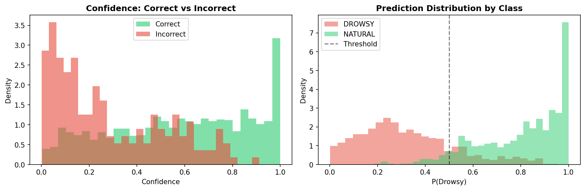
</p>

<p align="center">
  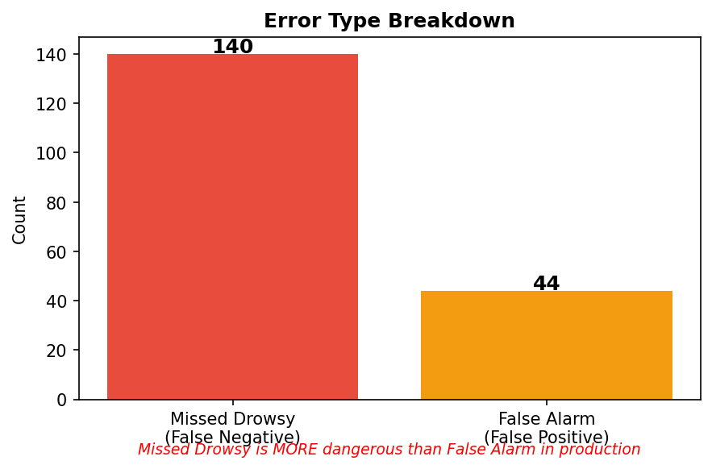
</p>

<p align="center">
  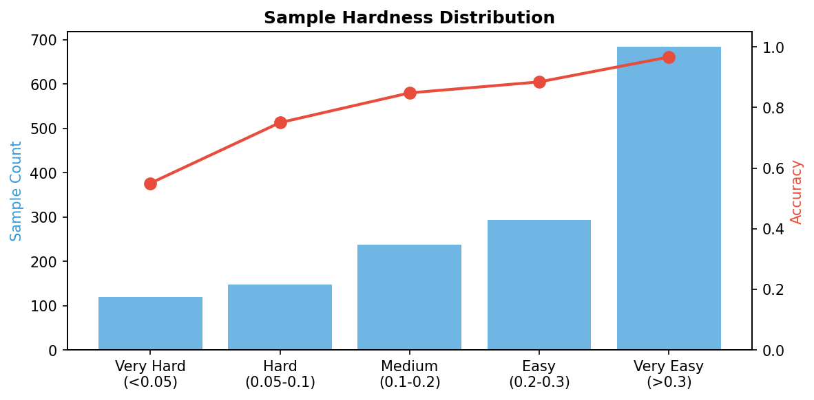
</p>

<p align="center">
  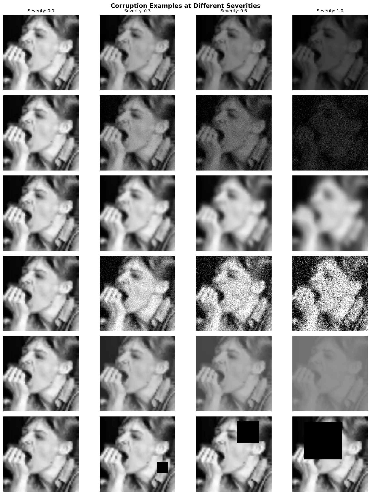
</p>

</details>

---

## Model Interpretability (Grad-CAM)

<p align="center">
  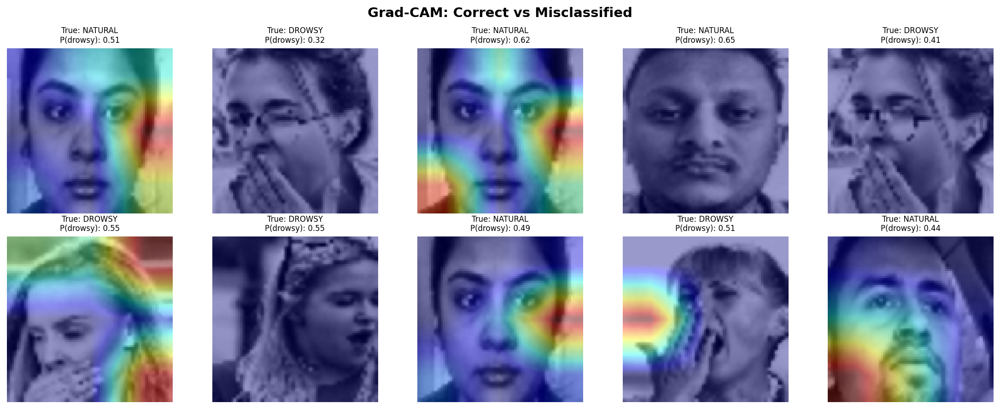
</p>

*Correct predictions show focused attention on eyelid/pupil. Misclassifications show diffuse attention — the model is uncertain about where to look.*

<details>
<summary><b>Per-class Grad-CAM grids</b></summary>

<p align="center">
  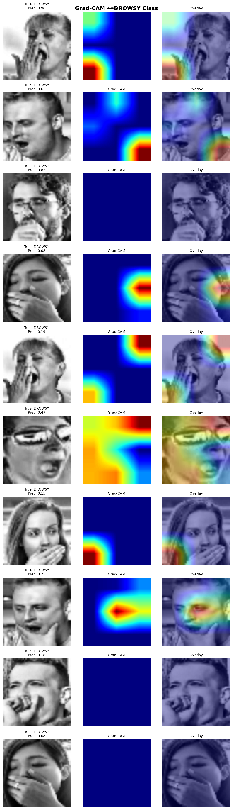
</p>

<p align="center">
  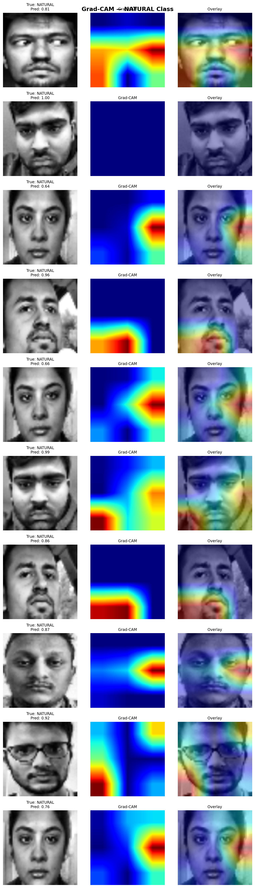
</p>

</details>

---

## Installation & Usage

```bash
git clone https://github.com/10kunalJain/drowsiness-detection.git
cd drowsiness-detection
conda create -n pp python=3.12 -y && conda activate pp
pip install -r requirements.txt
```

```bash
python train.py                 # Full 12-step pipeline (~40 min CPU)
python train.py --resume-from 7 # Resume if interrupted
python detect.py                # Webcam inference
python detect.py --video clip.mp4 --output result.mp4
```

```python
from src.api import DrowsinessAPI
api = DrowsinessAPI()
result = api.predict_frame(frame)
# → PredictionResult(state="DROWSY", probability=0.87, uncertainty=0.04,
#     fatigue_score=0.65, driver_state="MODERATE_FATIGUE", reliable=True)
```

<details>
<summary><b>Project structure</b></summary>

```
drowsiness-detection/
├── config.py                  # Hyperparameters & paths
├── train.py                   # 12-step training pipeline
├── detect.py                  # Real-time inference CLI
├── demo.py                    # Demo recording script
├── app.py                     # Streamlit web app
├── src/
│   ├── api.py                 # Production API
│   ├── data/                  # Loading, CLAHE, augmentation, EDA, quality analysis
│   ├── models/                # ResNet50V2, fatigue tracker, uncertainty, LSTM, multimodal
│   ├── engine/                # Training, benchmarking, improvement, inference
│   └── analysis/              # Grad-CAM, error analysis, robustness, failure narrative
└── outputs/                   # Generated plots, models, experiment logs
```

</details>

---

## Technical Deep Dive

<details>
<summary><b>Training strategy (CLAHE + two-phase fine-tuning + label smoothing)</b></summary>

- **CLAHE preprocessing:** Normalizes lighting variation — addresses the brightness bias found in data quality analysis
- **Phase 1 (epochs 1-15):** Frozen ResNet50V2 backbone, train head only (GAP → BN → Dense(128) → Dropout → Sigmoid)
- **Phase 2 (epochs 16-50):** Unfreeze top 50 backbone layers at 100x lower LR. Label smoothing (0.1) prevents overconfidence

</details>

<details>
<summary><b>System constraints & deployment path</b></summary>

| Constraint | Current | Production Path |
|:---|:---|:---|
| **Latency** | ~52ms/frame (CPU) | GPU/TensorRT → ~8ms |
| **Memory** | ~800 MB | TFLite → ~100 MB runtime |
| **Model size** | 94 MB / 23 MB TFLite | INT8 → ~12 MB |
| **Face detection failure** | Falls back to alert | Track "no face" duration |
| **Model drift** | Experiment logs as baseline | Periodic re-eval + model registry |

</details>

<details>
<summary><b>Why TTA over MC Dropout for uncertainty?</b></summary>

MC Dropout (`model(x, training=True)`) forces BatchNorm to compute statistics from a single image, collapsing all outputs to ~0.5. We discovered this during deployment — every prediction was identical regardless of input.

**Fix:** Test-Time Augmentation (TTA) adds small noise + random flips and measures prediction variance across augmented copies. This achieves the same goal (measuring prediction stability) using `model.predict()` which keeps BatchNorm in inference mode.

</details>

---

## The Failure Story

> Robustness testing revealed **low-light conditions caused a 36.5% accuracy drop**. Error analysis showed misclassified samples were systematically darker.
>
> **Fix:** CLAHE preprocessing + threshold optimization + hard example mining (2x weight on failures).
>
> **Result:** AUC 0.902 → **0.988** (+0.086). LSTM pushed sequence accuracy to **96.3%**.

---

## Future Work

- [ ] MediaPipe Face Mesh for 468-landmark head pose (replacing Haar cascade)
- [ ] IR camera support for night driving
- [ ] Driver-specific calibration (personalized fatigue baselines)
- [ ] Edge deployment on Jetson Nano with TensorRT
- [ ] Learn multimodal fusion weights via MLP on labeled driving sequences

---

## License

MIT
